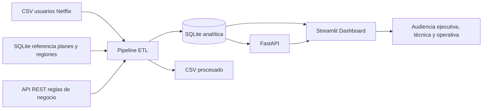

# Arquitectura técnica

## Decisiones técnicas

- **Python + Pandas**: limpieza, integración y transformación eficiente del dataset.
- **SQLite**: almacenamiento local reproducible y fácil de versionar para demo académica.
- **FastAPI**: exposición de métricas mediante endpoints REST.
- **Streamlit + Plotly**: dashboard interactivo con visualizaciones por audiencia.
- **Docker Compose**: orquestación de API, dashboard y ejecución ETL.
- **Pytest**: validación automatizada del esquema y transformación.

## Flujo ETL

1. Extract: lee CSV, tablas SQL y reglas tipo API.
2. Validate: valida columnas, rangos, nulos y duplicados.
3. Transform: crea `churned_binary`, `nivel_actividad`, `riesgo_login`, `engagement_score` y segmentos de riesgo.
4. Load: guarda CSV procesado y base `netflix_analytics.db`.
